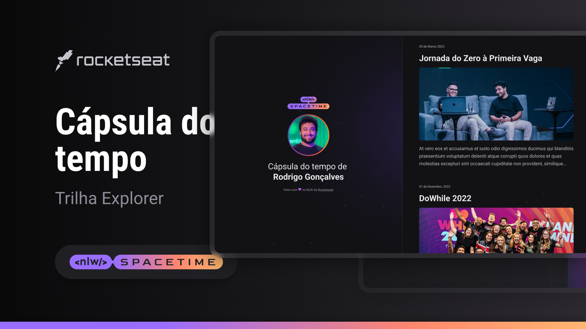

 

## 💻Project

This is a responsive web project of a time capsule to display memories on a timeline.

## 🚀Technologies

This project was developed during Rocketseat's NWL with the following technologies:

-HTML
-CSS
-Git and Github

## 🔺Layout

You can check the layout of the project through
[this link](<https://www.figma.com/file/oGL2SBzdFCuePq8S4BLunw/C%C3%A1psula-do-tempo-%E2%80%A2-Trilha-Explorer-(Community)-(Copy)?type=design&node-id=306%3A84&t=9D6B5QxyMDog6fBC-1>)
E necessário ter uma conta no [Figma](https://www.figma.com)
